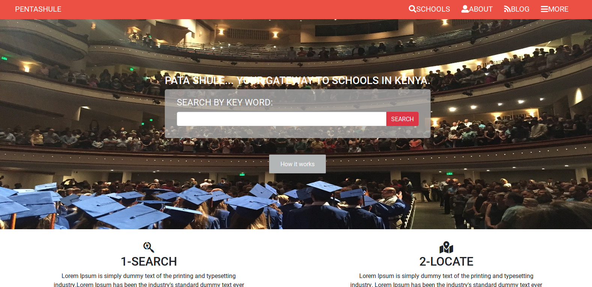

# DirectoryOfSchools_H-C_CP
> This is the Captstone Project for the Microverse CSS and HTML curriculum. This project consists of creating a Directory of Schools web platform according to the presentation shows in this page(https://www.behance.net/gallery/25563385/PatashuleKE)

## Built With

- HTML,
- CSS (Grid, Flexbox)
- Bootstrap 4.4

## How to clone this project

You should follow the given design of the website that you can see through this link https://www.behance.net/gallery/25563385/PatashuleKE 

You have to respect these instructions :

Whatever the content for the directory you may choose, you should build these 3 pages as the minimum requirements:

- the main page (search page), with a link to the results page
- the search results page, with a list of schools each with a link to the detail school page
- the detail school page
 

Each of these pages should have versions for 3 different screen sizes: 

- mobile: up to 768px
- tablet: up to 1024px
- desktop: from 1024px

You should follow the guidelines of the given design, including:

- colors (they are not explicitly in the design, but you can pick them from the design page)
- typographies: font face, size and weight (use a similar one given the design)
- layout: composition and space between elements, for the 3 given screen sizes

## Live Demo

[Live Demo Link](https://rawcdn.githack.com/sipe-daniel/DirectoryOfSchools_H-C_CP/7ee3fbb75fb9259d80054cd5552253671fa3ff8f/index.html)

## Author

👤  **Daniel Jordan Sipe Tchawou**

- Github: [@githubhandle](https://github.com/sipe-daniel)
- Linkedin: [linkedin](https://linkedin.com/in/daniel-jordan-sipe-tchawou)

## Credits
All credits for the design goes to [PatashuleKE](https://www.behance.net/gallery/25563385/PatashuleKE)